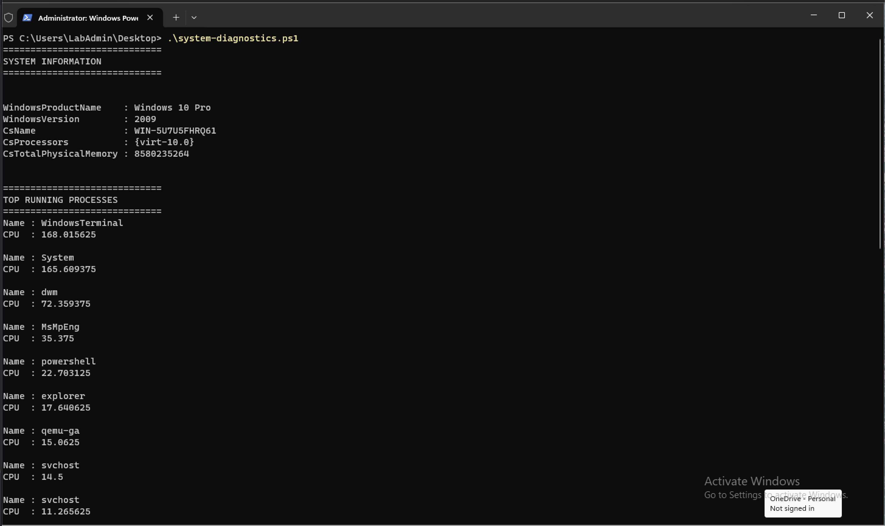
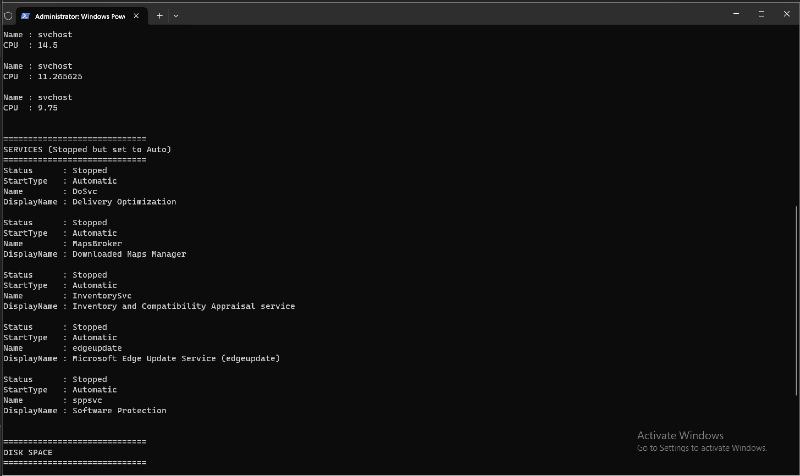
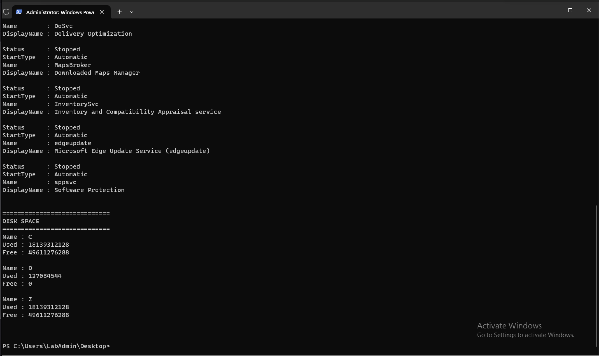

# Helpdesk Automation Script

PowerShell diagnostic tool used by helpdesk technicians to quickly gather system information during troubleshooting.

## Overview

This project contains a PowerShell script designed to collect essential system information that a Tier-1 Help Desk technician typically checks when diagnosing issues such as slow performance, application crashes, or service failures.

The script automates common diagnostic checks and prints results in a readable format.

## Skills Demonstrated

- PowerShell scripting
- Windows system diagnostics
- Process monitoring (top CPU usage)
- Service state checks (Stopped + Automatic)
- Disk space checks
- Tier-1 troubleshooting workflow

## Script

system-diagnostics.ps1

Collects:

- Windows system information
- Top CPU-consuming processes
- Services that are stopped but configured to start automatically
- Disk usage

## How to Run

Open PowerShell in the script directory and run:

.\system-diagnostics.ps1

## Example Output

## Example Helpdesk Scenario

A user reports their computer is running extremely slow.

A helpdesk technician can run this script to quickly check:

- High CPU usage processes
- Services that failed to start
- Disk space availability
- Basic system information

The results provide a quick diagnostic snapshot to support troubleshooting or escalation.

## Repository Structure

helpdesk-automation/
├── system-diagnostics.ps1
├── README.md
└── screenshots/
    ├── script-output-1.png
    ├── script-output-2.png
    └── script-output-3.png
